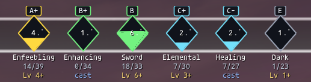
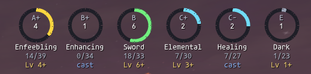
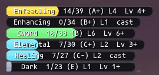
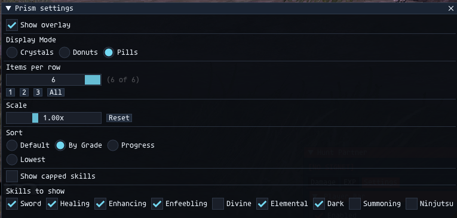

# Prism

A floating skill overlay for **FFXI** (Ashita v4). Shows every skill your main job has access to — combat, defense, magic, and crafting — with tier-colored crystals, donuts, or pills, plus effective level and minimum mob level hints so you know what to hunt next.



## Display modes

| Crystals (default) | Donuts | Pills |
|---|---|---|
|  |  |  |

Tier color encodes rank: **A+ gold**, **B green**, **C cyan**, **D blue**, **E/F grey**.

## All skills, four categories

Prism groups every skill your main job can train into four toggleable categories. Equipped weapons sort first, then combat → defense → magic → craft.

<!-- TODO(snippet): screenshot of the full overlay on DRK showing combat + defense + magic categories side by side, equipped GAxe + Scythe first -->
<!-- TODO(snippet): screenshot of /prism settings panel with the new "Show categories" row (Combat / Defense / Magic / Craft checkboxes) visible -->
<!-- TODO(snippet): chat screenshot of /prism diag output on DRK showing engine cap vs. table cap per skill -->

| Category | What's shown | Filter |
|---|---|---|
| **Combat** | Weapons 1H/2H + ranged | Skills your main job has any rank in, plus anything currently equipped |
| **Defense** | Guard, Evasion, Shield, Parry | Defense skills your main job has a rank in |
| **Magic** | Divine, Healing, Enhancing, Enfeebling, Elemental, Dark, Summoning, Ninjutsu | Casting schools your main job actively casts spells in (no sub-job spillover) |
| **Craft** | Fishing, Woodworking, Smithing, Goldsmithing, Clothcraft, Leathercraft, Bonecraft, Alchemy, Cooking | Only skills you've actually trained (cur > 0 or fractional > 0) |

## Features

- **All-skills overlay** grouped into Combat / Defense / Magic / Craft categories, each independently toggleable
- **Per-job filtering**: only shows skills your main job actually has access to — no clutter from sub-job spillover
- **HorizonXI-calibrated** cap curves and per-job rank tables (transcribed from Nerf's [FFXI Skill Calculator spreadsheet](https://docs.google.com/spreadsheets/d/1VE4as2FWwrD4e_lJ4h1wG6Ga50PAJGzGaWkOGOx0mvE/edit) — retail caps differ on Horizon)
- **Engine cap as source of truth**: when the game exposes `GetCap()`, Prism trusts it over static tables (handles server-side rank divergence and crafting/defense skills that have no rank table)
- **Three display modes**: tier-colored FFXI crystals (default), OSRS-style donuts, or compact text pills
- **Effective level + min-mob hints** for combat and magic (suppressed for defense/craft since they don't apply)
- **Skillup capture** via packet `0x29` (authoritative tenths) with a chat fallback — fractional progress survives between integer ticks
- **Sort modes**: Default (equipped → category → sid), By Grade, Progress %, Lowest
- **Enhanced chat skillup messages** (opt-in) for defense and craft too — they finally get their announcements
- **Per-skill visibility toggles**, capped-skill filter, items-per-row, and a 0.6×–2.0× scale slider
- **Chrome-less overlay** — drag freely, configure with `/prism`

Skill capture adapted from [Jull256/skilluptracker](https://github.com/Jull256/skilluptracker) (Mujihina original).

## Install

1. Drop the `prism` folder into `Ashita/addons/`
2. In game: `/addon load prism`
3. Open settings: `/prism`

## Commands

```
/prism                              -- open settings panel (also /pr)
/prism on | off | toggle            -- show/hide overlay
/prism mode crystals|donuts|pills   -- display style
/prism perrow 1..24                 -- items per row
/prism capped                       -- toggle showing capped skills
/prism category <name> [on|off]     -- toggle a category (combat|defense|magic|craft)
/prism persistfrac on|off|toggle    -- persist fractional skill progress across /logout
/prism chat on|off|toggle           -- enhanced chat skillup messages (off by default)
/prism diag                         -- dump engine cap vs. table cap per skill (calibration)
/prism colortest                    -- preview every chat-skillup palette swatch
/prism show <name>                  -- show a specific skill (e.g. Elemental)
/prism hide <name>                  -- hide a specific skill
/prism reset                        -- reset window position
```

## Settings panel



<!-- TODO(snippet): replace settings.png with a fresh capture that includes the "Show categories" row -->

Open with `/prism` or `/pr`. All options persist to Ashita's per-character config.

## Notes

- **Everything is gated by main job**. Combat, defense, and magic categories filter to skills your main job actually has access to — flip jobs and the overlay reshapes automatically. No more Healing/Enhancing/Divine clutter on DRK.
- **Crafting only appears once trained.** Crafts have no rank table, so Prism only shows a craft skill if you've earned at least 0.1 in it.
- **Engine cap > static table.** When the game exposes a cap via `GetCap()`, Prism uses it directly. The static `CAP_REF`/`JOB_SKILL_RANK` tables are HorizonXI-calibrated fallbacks for cases where the engine returns 0 or nil. Run `/prism diag` to see both side by side for every skill.
- **Fractional skill (e.g. 9.1) only flows via chat/packet** — the game's memory only exposes integers. Prism saves your fractional progress to Ashita's per-character config (toggle in settings or `/prism persistfrac off`), so a `/logout` doesn't throw away the 0.1–0.9 you already earned.
- **Enhanced chat skillup messages** are *off by default* (toggle in settings or `/prism chat on`). When enabled, Prism replaces the game's default `Your X skill rises 1 point` line with a colored version showing the fractional total and cap, e.g. `Your sword skill rises 0.3 points (95.4 / 100)`. Defense and craft skillups also get the enhanced treatment. If you also run [skilluptracker](https://github.com/Jull256/skilluptracker), keep one or the other enabled — not both — to avoid double-printed lines.

## Acknowledgments

- **Nerf (nerfonline)** from the Ashita Discord shared the [FFXI Skill Calculator spreadsheet](https://docs.google.com/spreadsheets/d/1VE4as2FWwrD4e_lJ4h1wG6Ga50PAJGzGaWkOGOx0mvE/edit) covering canonical L1–75 skill caps and per-job rank assignments for both Horizon and Retail. Prism v0.7.0 ships with the Horizon data fully integrated. Thanks, Nerf.
- **Click** for the relentless playtesting and the design conversations that turned a one-off weapon-skill display into a four-category job-aware overlay.
- Skillup capture pattern (packet `0x29` MessageNum 38/53) and enhanced chat skillup message format adapted from [Jull256/skilluptracker](https://github.com/Jull256/skilluptracker) (Mujihina original).

## License

GPL-3.0 — see [LICENSE](LICENSE).
